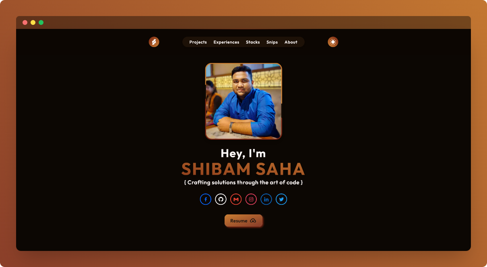
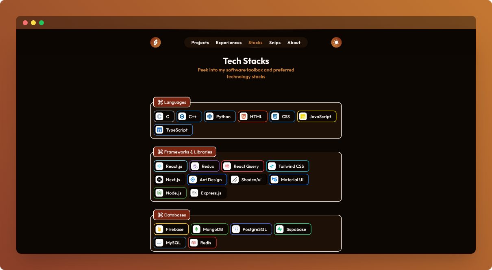
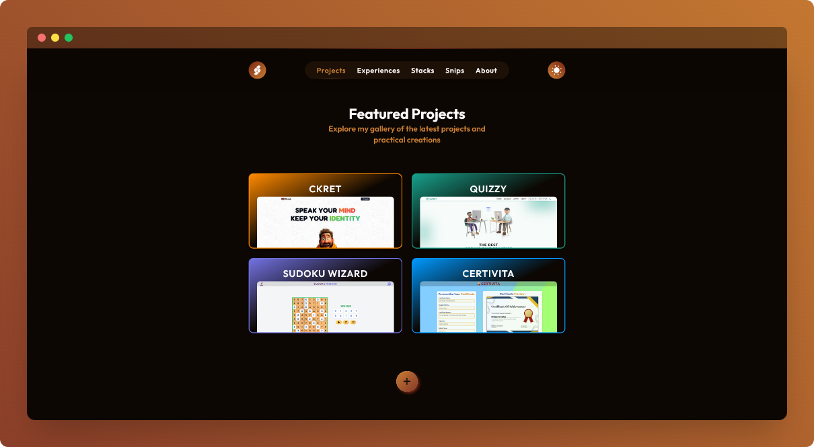

    

    <h1>Shibam Saha</h1>
    
Portfolio

    
    

 

## ⚡ Introduction

A computer science undergrad's portfolio website showcasing all accomplishments and project-works in the respective domain.

## ⚙️ Tech Stack

- Next JS
- TypeScript
- Tailwind CSS
- Framer Motion

## 📦 Other Libraries and Tools

- ES Lint
- Boxicons
- React Simple Icons
- Email JS

## 🎯 Goals

- [x] Design and create a visually stunning portfolio with captivating animations
- [x] Integrate email functionality seamlessly using Email JS for enhanced communication
- [x] Implement link redirection service for personal links

## 🖼️ Screenshots

## 👋🏻 Contact

